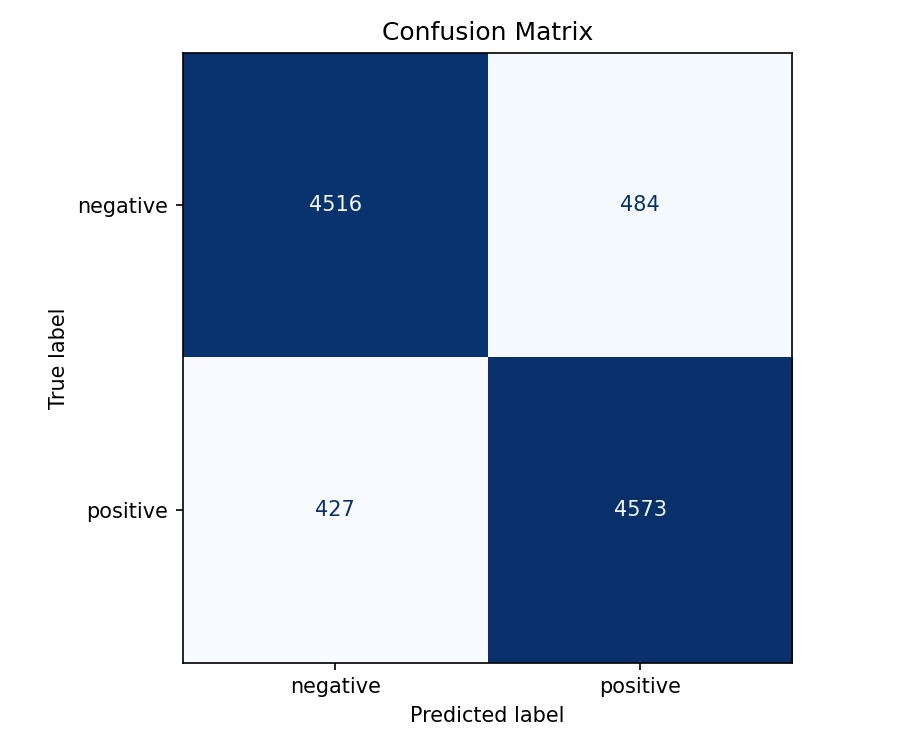
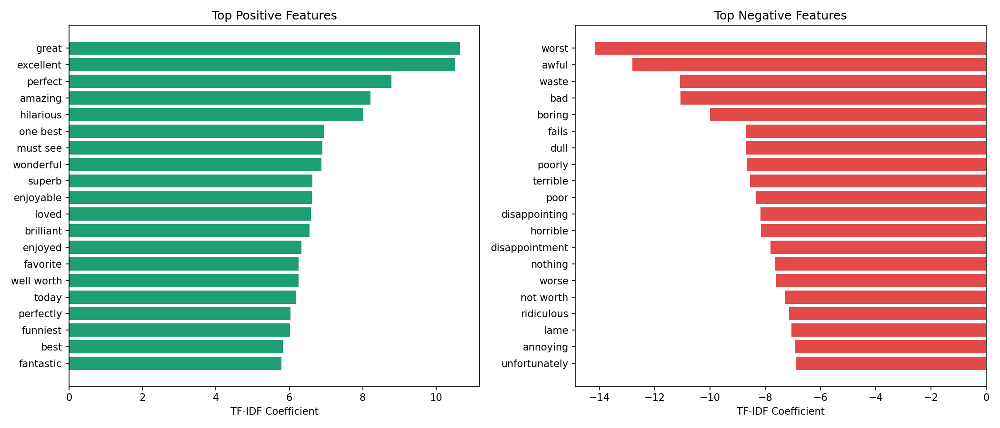
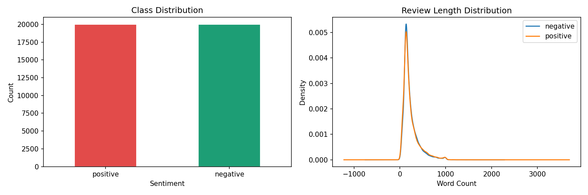

# Sentiment Analysis using IMDB Dataset

Binary text classification to predict positive/negative movie review sentiment.

## Results
| Metric | Score |
|--------|-------|
| Accuracy | 90.89% |
| F1-Score (Positive) | 0.91 |
| F1-Score (Negative) | 0.91 |

## Tech Stack
Python · scikit-learn · NLTK · pandas · TF-IDF · Logistic Regression

## Pipeline
1. Load 50,000 IMDB reviews from CSV
2. Preprocess — strip HTML, remove stopwords (keep negations), lemmatize
3. TF-IDF vectorization (50k features, bigrams)
4. Train Logistic Regression (C=5.0)
5. Evaluate — accuracy, F1, confusion matrix
6. Serialize model with pickle

## Output Visuals

## Dataset
[IMDB Dataset — Kaggle](https://www.kaggle.com/datasets/lakshmi25npathi/imdb-dataset-of-50k-movie-reviews)